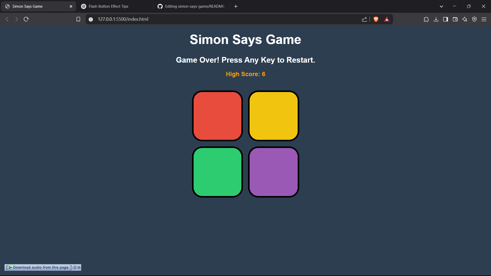

# 🎮 Simon Says Game

A fun and interactive **Simon Says** memory game built with **HTML, CSS, and JavaScript**. The game challenges players to remember and repeat an increasingly long sequence of colors!

## 🚀 Live Demo
🔗 **Play Here:** [Your GitHub Pages Link](https://rohits78.github.io/simon-says-game/)

## 📌 Features
✅ Randomized color sequences 🎨  
✅ Scoreboard & High Score Tracking 🏆  
✅ Sound Effects for Buttons 🔊  
✅ Leaderboard (Stores Top 5 Scores) 📊  
✅ Responsive & Stylish UI ✨  

## 📷 Screenshot


## 🛠️ Technologies Used
- **HTML** for structure
- **CSS** for styling
- **JavaScript** for game logic
- **localStorage** for saving high scores

## 🎯 How to Play
1. **Press any key** to start the game.
2. Watch the sequence of colors flash. 👀
3. Click the buttons in the correct order. 🎯
4. The sequence gets longer after each correct round.
5. If you click the wrong button, the game ends! ❌

## 🖥️ Installation & Setup
1. **Clone this repository:**
   ```sh
   git clone https://github.com/rohits78/simon-says-game.git
   cd simon-says-game
   ```
2. Open `index.html` in your browser.
3. Have fun playing! 🎮

## 📢 Deploying to GitHub Pages
1. Go to **Settings** → **Pages** in your repository.
2. Under **Branch**, select `main` and click **Save**.
3. Your game will be live at:
   ```
   https://rohits78.github.io/simon-says-game/
   ```

## 📌 Future Improvements
- Add player names to the leaderboard 🏷️
- Online multiplayer mode 🌐
- Mobile-friendly optimizations 📱

## ❤️ Contributing
Want to improve this game? Fork the repo, make your changes, and submit a pull request!

## 📜 License
This project is open-source and available under the **MIT License**.

---
**Made with ❤️ by [Rohit Kumar]**

